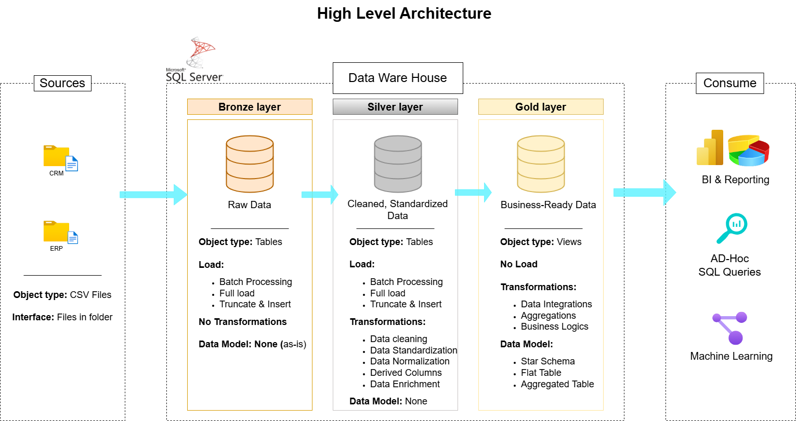

# Data Warehouse and Analytics Project
A modern data warehouse built with SQL Server, following the Medallion Architecture to transform raw source data into clean, business-ready data for analytics and reporting.

---

## Project Overview
This project demonstrates the development of a data warehouse using SQL Server.
This project involves:

1. **Data Architecture:** Designing a Modern Data Warehouse using Medallion Architecture (Bronze, Silver, Gold layers).
2. **ETL Pipelines:** Extracting, transforming, and loading data from source systems into the warehouse.
3. **Data Modeling:** Developing fact and dimension tables optimized for analytical queries.
4. **Analytics & Reporting:** Creating SQL-based reports and dashboards for actionable insights.

---

## Data Architecture
The project follows the Medallion Architecture:

- **Bronze Layer:** Stores raw data loaded from the source systems.
- **Silver Layer:** Contains cleaned, standardized, and transformed data.
- **Gold Layer:** Contains business-ready data structured for analytics and reporting.



---

## Data Sources
The project uses data from two source systems:

- **CRM:** Customer, product, and sales information
- **ERP:** Customer, location, and product category information

The source data is provided in CSV format.

---

## Data Warehouse Model
The Gold layer follows a **star schema**, consisting of:

- **Dimension tables:** Customer and product information
- **Fact table:** Sales transactions and business measures

## Tools & Technologies
- SQL Server
- T-SQL
- SQL Server Management Studio (SSMS)
- Draw.io
- GitHub

## Project Structure

```text
